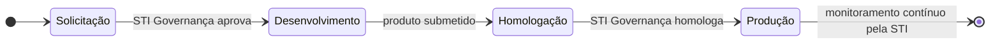
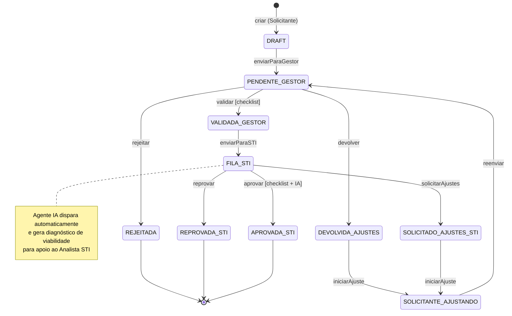
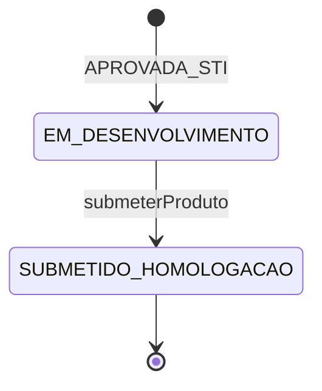
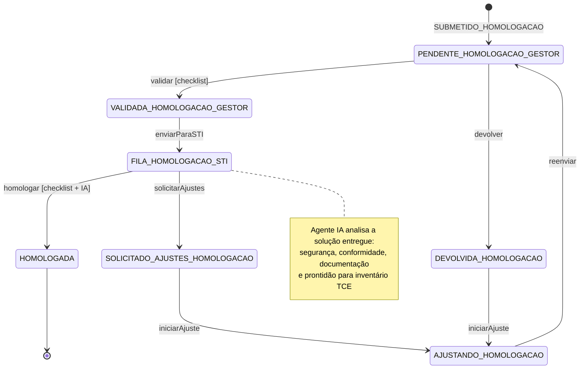
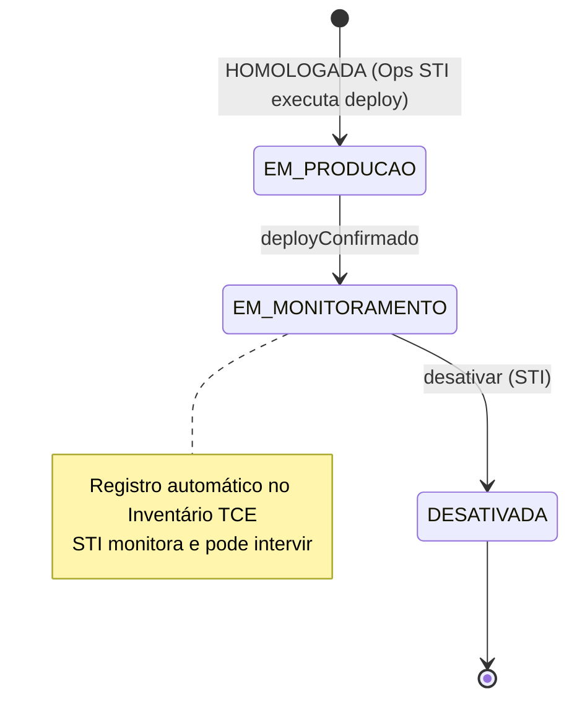

# Fluxo de Demandas — Agilize 2.0

> Atualizado: 2026-05-06 | Conformidade: N-PSI-016  
> Contexto: soluções setoriais leves — painéis BI, scripts, agentes, sistemas vibe coded

---

## Visão Geral



---

## Fase 1 — Solicitação

O Solicitante descreve a solução que pretende construir. Passa pela validação do Gestor da unidade e pela análise de viabilidade da STI Governança.



---

## Fase 2 — Desenvolvimento

A unidade solicitante constrói a solução. A STI não participa desta fase.  
Quando pronto, o Solicitante submete o produto para homologação.



---

## Fase 3 — Homologação

Espelho da Fase 1. Gestor valida o produto entregue, STI Governança homologa.  
Não há reprovação — apenas ajustes em loop se necessário.



---

## Fase 4 — Produção e Monitoramento

Ops STI executa o deploy. Ao confirmar, a solução entra em monitoramento contínuo e é registrada automaticamente no Inventário TCE.



---

## Cancelamento

Disponível até `SUBMETIDO_HOMOLOGACAO`. Não cancela demanda em homologação ou produção.  
Atores: Gestor Unidade / Analista STI / Admin.

---

## Estados — Lista Completa (23)

### Fase 1 — Solicitação
| Estado | Descrição |
|---|---|
| DRAFT | Rascunho criado pelo Solicitante |
| PENDENTE_GESTOR | Aguardando validação do Gestor |
| DEVOLVIDA_AJUSTES | Gestor devolveu para ajustes |
| SOLICITANTE_AJUSTANDO | Solicitante editando após devolução |
| VALIDADA_GESTOR | Gestor aprovou, aguarda envio à STI |
| FILA_STI | Fila de análise da STI Governança |
| SOLICITADO_AJUSTES_STI | STI solicitou ajustes (volta ao Gestor) |
| APROVADA_STI | Autorização para desenvolver emitida |
| REPROVADA_STI | STI reprovou — terminal |
| REJEITADA | Gestor rejeitou — terminal |

### Fase 2 — Desenvolvimento
| Estado | Descrição |
|---|---|
| EM_DESENVOLVIMENTO | Unidade construindo a solução |
| SUBMETIDO_HOMOLOGACAO | Produto submetido para homologação |

### Fase 3 — Homologação
| Estado | Descrição |
|---|---|
| PENDENTE_HOMOLOGACAO_GESTOR | Aguardando validação do Gestor |
| DEVOLVIDA_HOMOLOGACAO | Gestor devolveu produto para ajustes |
| AJUSTANDO_HOMOLOGACAO | Solicitante corrigindo o produto |
| VALIDADA_HOMOLOGACAO_GESTOR | Gestor aprovou produto |
| FILA_HOMOLOGACAO_STI | Fila de homologação da STI Governança |
| SOLICITADO_AJUSTES_HOMOLOGACAO | STI solicitou ajustes no produto |
| HOMOLOGADA | Produto aprovado para produção |

### Fase 4 — Produção
| Estado | Descrição |
|---|---|
| EM_PRODUCAO | Ops STI executando o deploy |
| EM_MONITORAMENTO | Solução viva e monitorada pela STI |
| DESATIVADA | Solução retirada de operação — terminal |

### Transversal
| Estado | Descrição |
|---|---|
| CANCELADA | Cancelamento administrativo — terminal |

---

## Perfis

| Perfil | Papel | Fases |
|---|---|---|
| SOLICITANTE | Cria a demanda e desenvolve a solução | 1, 2, 3 |
| GESTOR_UNIDADE | Valida solicitação e produto entregue | 1, 3 |
| GESTOR_DEPARTAMENTO | Supervisão e relatórios | todas |
| ANALISTA_STI | Governança — analisa viabilidade e homologa | 1, 3 |
| RESPONSAVEL_PRODUCAO | Ops STI — executa deploy | 4 |
| GESTOR_SISTEMA | Admin total | todas |

> Perfis RESPONSAVEL_DESENVOLVIMENTO e RESPONSAVEL_HOMOLOGACAO foram removidos.  
> O Solicitante desenvolve. A STI Governança homologa.

---

## Checklists

### Solicitante — ao submeter demanda
- [ ] Título claro e descritivo
- [ ] Tipo de solução definido (BI / Script / Agente / Sistema)
- [ ] Justificativa com impacto para a unidade
- [ ] Responsável técnico da unidade designado
- [ ] Dados sensíveis identificados e mapeados

### Gestor Unidade — validação da solicitação (Fase 1)
- [ ] Alinhado com estratégia da unidade
- [ ] Sem duplicidade com solução já existente
- [ ] Responsável técnico é adequado para o tipo de solução
- [ ] Dentro do escopo N-PSI-016 (solução setorial leve)
- [ ] Riscos de negócio avaliados

### Analista STI — análise de viabilidade (Fase 1)
- [ ] Viável com infraestrutura disponível
- [ ] Não conflita com sistemas corporativos
- [ ] Riscos de segurança aceitáveis
- [ ] Conformidade com normas institucionais
- [ ] Diagnóstico do agente IA revisado

### Gestor Unidade — validação do produto (Fase 3)
- [ ] Produto entregue conforme especificação aprovada
- [ ] Usuários-chave testaram e aprovaram
- [ ] Documentação mínima presente
- [ ] Plano de contingência ou suporte definido

### Analista STI — homologação (Fase 3)
- [ ] Diagnóstico IA de segurança revisado
- [ ] Sem credenciais ou dados sensíveis expostos
- [ ] Atende todos os requisitos da demanda aprovada
- [ ] Campos do inventário TCE preenchidos
- [ ] Responsável de monitoramento designado

---

## Agente IA de Diagnóstico

Dispara **automaticamente e assincronamente** ao entrar em `FILA_STI` e `FILA_HOMOLOGACAO_STI`.  
Não bloqueia o fluxo. Resultado aparece como painel de apoio para o Analista STI.

### Diagnóstico de Submissão (Fase 1)
Analisa a demanda descrita pelo Solicitante:
- Complexidade e esforço estimados
- Riscos identificados
- Conformidade preliminar com N-PSI-016
- Verificação de duplicidades com soluções existentes
- **Recomendação:** APROVAR / SOLICITAR AJUSTES / REPROVAR

### Diagnóstico de Homologação (Fase 3)
Analisa a solução entregue (URL, repositório, arquivo):
- Verificação de segurança (credenciais, dados expostos)
- Conformidade com a especificação aprovada na Fase 1
- Qualidade e presença de documentação
- Prontidão para registro no inventário TCE
- **Recomendação:** HOMOLOGAR / SOLICITAR AJUSTES

---

## Inventário TCE

Gerado automaticamente ao entrar em `EM_MONITORAMENTO`.

| Campo | Descrição |
|---|---|
| numero_demanda | Origem — DM-2026-XXX |
| nome_solucao | Definido pelo Solicitante |
| tipo_solucao | BI / Script / Agente / Sistema |
| unidade_responsavel | Unidade solicitante |
| gestor_responsavel | Gestor que validou |
| responsavel_tecnico | Responsável da unidade |
| responsavel_monitoramento | Analista STI designado |
| versao | 1.0 (incrementa a cada atualização) |
| data_producao | Automático |
| status | ATIVA / DESATIVADA |

---

## Regra Central N-PSI-016

```
Solicitante → Gestor Unidade → STI Governança
```

Nunca: Solicitante encaminha diretamente para STI.  
Sempre: Após qualquer ajuste (Gestor ou STI), o ciclo completo recomeça pelo Gestor.  
Válido nas duas fases: solicitação e homologação.
